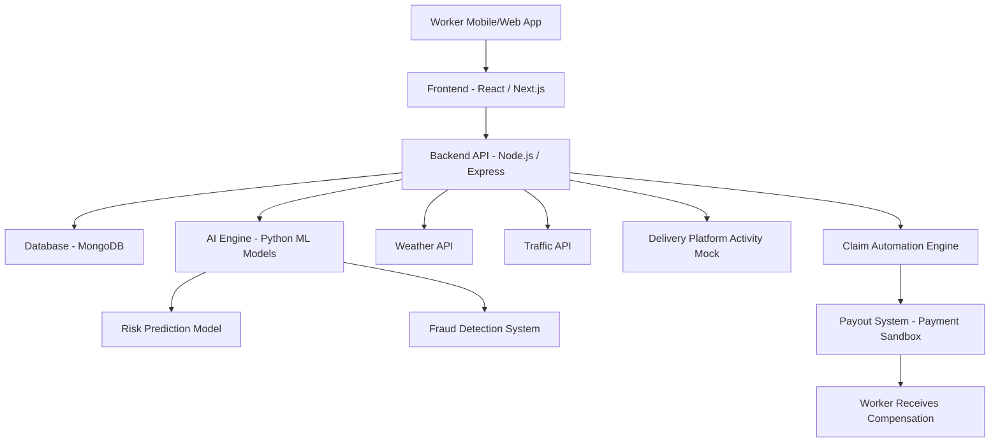

# GigShield AI 🛡️

## 🎥 Phase 1 Strategy Video

**[Watch our Strategy & Idea Pitch on Google Drive](https://drive.google.com/file/d/1wZEXMwtiGwuAiHDdw3YlAThXuXKnm6_3/view?usp=sharing)**

---

## AI-Powered Parametric Income Protection for Gig Delivery Workers

GigShield AI is an AI-powered parametric insurance platform designed to protect gig delivery workers from income loss caused by external disruptions such as heavy rain, pollution, floods, and curfews.

Gig workers depend on daily earnings to sustain their livelihood. When external disruptions occur, deliveries stop and workers instantly lose income. GigShield AI detects these disruptions using AI and external data sources and compensates workers through automated parametric insurance payouts.

Our mission is to build a financial safety net for the gig workforce.

---

# 📌 Project Overview

| Feature        | Description                                        |
| -------------- | -------------------------------------------------- |
| Target Users   | Food delivery workers (Swiggy / Zomato)            |
| Problem        | Income loss due to weather, pollution, and curfews |
| Solution       | AI-powered parametric insurance                    |
| Pricing Model  | Weekly insurance plans                             |
| AI Components  | Risk prediction + fraud detection                  |
| Unique Feature | Income Stability Score                             |
| Architecture   | MERN stack + Python AI engine                      |

---

# 📅 Phase 1 – Ideation & Foundation

This repository contains the core strategy, persona research, and system architecture for the Phase-1 submission.

Phase-1 focuses on:

- Understanding the gig worker persona
- Designing an AI-powered insurance solution
- Defining parametric disruption triggers
- Planning system architecture
- Outlining the development roadmap

Future phases will focus on building the working platform and automated claim system.

---

# 👤 Target Persona – Food Delivery Riders

We selected food delivery partners such as **Swiggy and Zomato** as our primary persona.

### Worker Profile

Daily Earnings: **₹800 – ₹1200**

Deliveries per day: **18–25**

Working hours: **8–10 hours**

### Key Risks

Delivery riders frequently face disruptions such as:

- Heavy rain and flooding
- Severe air pollution
- Traffic shutdowns
- Curfews or local strikes

These events reduce the number of deliveries riders can complete, causing immediate income loss.

---

# 🧩 Persona Scenarios

GigShield AI automates claim detection using **parametric triggers**.

## Scenario A – Monsoon Disruption

Event  
Heavy rainfall (>70mm) occurs during peak delivery hours in Mumbai.

System Response

1. Weather API detects extreme rainfall.
2. Delivery platform activity drops significantly.
3. Traffic speeds fall below threshold levels.

Result  
GigShield AI automatically triggers a claim and compensates the worker for lost income.

---

## Scenario B – Fraud Attempt

Event  
A user attempts to spoof their GPS location to falsely claim disruption compensation.

AI Detection

The fraud detection system verifies:

- Real weather conditions
- Worker activity logs
- GPS consistency

Result  
The claim is flagged as suspicious and denied.

---

# 💰 Weekly Insurance Pricing Model

Gig workers operate on weekly earning cycles, so GigShield AI uses a weekly insurance model.

| Plan     | Weekly Premium | Income Protection |
| -------- | -------------- | ----------------- |
| Basic    | ₹15/week       | ₹400 payout       |
| Standard | ₹25/week       | ₹700 payout       |
| Premium  | ₹40/week       | ₹1200 payout      |

⚠ Coverage applies strictly to **income loss only**.

The platform does not cover:

- vehicle repairs
- medical claims
- health insurance
- accident insurance

---

# 🧠 AI & Machine Learning Integration

## Risk Prediction Model

Machine learning models analyze disruption data to estimate risk levels.

Inputs include:

- Historical rainfall data
- Flood occurrence frequency
- Traffic congestion patterns
- Delivery demand trends

Output:

Risk score for each delivery zone.

---

## Fraud Detection System

To prevent fraudulent claims the system detects anomalies such as:

- GPS spoofing
- Duplicate claims
- Fake disruption claims

Anomaly detection models verify worker activity before approving payouts.

---

# ⭐ Income Stability Score (Predictive AI)

GigShield AI introduces an **Income Stability Score**, an AI-generated score that predicts income disruption risk for gig workers.

Score Range: **0 – 100**

Example

Worker: Rahul  
City: Mumbai  
Zone: Andheri

Income Stability Score: **72 / 100**  
Risk Level: Moderate

---

### Score Calculation

Income Stability Score =

Weather Risk (30%)

- Traffic Risk (20%)
- Demand Stability (30%)
- Historical Disruptions (20%)

---

### Worker Dashboard Example

Income Stability Score: **72 / 100**

Risk Alerts

⚠ Heavy rain expected tomorrow  
⚠ Delivery demand drop predicted

Recommendation  
Upgrade to **Premium Coverage** this week.

---

### Why This Feature Matters

Traditional systems react after disruptions occur.

GigShield AI predicts risk **before disruptions happen**, allowing workers to proactively protect their income.

---

# 🏗 System Architecture

Frontend  
React / Next.js

Backend  
Node.js / Express

AI Engine  
Python (Scikit-learn)

Database  
MongoDB

External APIs

- Weather API
- Traffic API
- Delivery platform activity mock
- Payment gateway sandbox

---

# System Architecture Diagram

