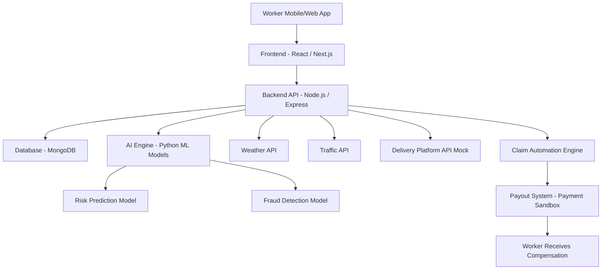

# GigShield AI

## AI-Powered Parametric Insurance for Gig Delivery Workers

GigShield AI is an intelligent insurance platform designed to protect gig delivery workers from income loss caused by external disruptions such as heavy rain, pollution, and curfews.

The platform uses AI-powered risk assessment and parametric triggers to automatically detect disruptions and compensate workers for lost income.

## Phase 1 Deliverables

This repository contains the Phase 1 ideation and system design for the DEVTrails hackathon.

Phase 1 focuses on:

- Understanding the gig worker persona
- Designing an AI-powered insurance solution
- Defining disruption triggers
- Planning system architecture
- Outlining the development roadmap

Future phases will focus on implementing the platform and deploying the automated insurance system.

## 2. Target Persona

### Food Delivery Riders (Swiggy / Zomato)

Primary characteristics:

- Daily earnings: ₹800 – ₹1200
- Average deliveries per day: 18–25
- Working hours: 8–10 hours

### Major Risks

- Heavy rain and floods
- Severe pollution
- Curfews or strikes
- Traffic disruptions

These disruptions directly reduce the number of deliveries a rider can complete, leading to immediate income loss.

## 3. Our Solution

GigShield AI provides an automated income protection system for gig delivery workers.

Key features:

- AI-powered risk prediction
- Dynamic weekly insurance pricing
- Real-time disruption detection
- Automatic claim triggering
- Instant payout simulation

The platform eliminates the need for manual claim filing using parametric insurance triggers.

## 4. Disruption Trigger Logic

GigShield AI monitors multiple external signals to detect disruptions.

Example trigger condition:

Rainfall > 70mm  
AND  
Traffic speed < 10 km/h  
AND  
Delivery orders drop by 50%

When these conditions are satisfied, the system automatically triggers the insurance claim.

## 5. Weekly Insurance Pricing Model

| Plan     | Weekly Premium | Coverage     |
| -------- | -------------- | ------------ |
| Basic    | ₹15/week       | ₹400 payout  |
| Standard | ₹25/week       | ₹700 payout  |
| Premium  | ₹40/week       | ₹1200 payout |

AI dynamically adjusts the premium based on the disruption risk level of the delivery zone.

## 6. AI Integration

### Risk Prediction Model

Machine learning models analyze historical disruption data to predict risk levels.

Inputs:

- Historical rainfall data
- Traffic congestion
- Delivery demand patterns
- Flood frequency

Output:

- Risk score for delivery zones

### Fraud Detection

The platform prevents fraudulent claims using anomaly detection.

Examples:

- GPS spoof detection
- Duplicate claim detection
- Fake disruption claims

## 7. System Architecture

Frontend  
React / Next.js

Backend  
Node.js / Express

AI Engine  
Python (Scikit-learn)

Database  
MongoDB

External APIs  
OpenWeather API  
Traffic API  
Payment gateway sandbox

## System Architecture Diagram



### Architecture Explanation

The system follows a modular architecture.

1. Workers interact with the platform through a web or mobile interface.
2. The frontend communicates with the backend API built using Node.js.
3. The backend integrates with external APIs such as weather and traffic data sources.
4. AI models analyze disruption risks and detect fraudulent activity.
5. When disruption triggers are validated, the claim automation engine initiates payouts.
6. The payout system simulates compensation to the worker using a payment gateway sandbox.

## 8. System Workflow

1. Worker registers on the platform.
2. Worker selects a weekly insurance plan.
3. The system continuously monitors disruption signals using external APIs.
4. When a disruption is detected, the system verifies worker activity.
5. If conditions are satisfied, a claim is automatically triggered.
6. Compensation is issued to the worker.

## 9. Unique Feature – Risk Map Dashboard

GigShield AI includes a dynamic risk map showing disruption-prone delivery zones.

Workers can view:

- flood-prone areas
- high rainfall zones
- pollution alerts

This helps workers make informed decisions about when and where to work.

## Development Roadmap

### Phase 1 – Ideation & System Design
- Define target persona
- Design disruption trigger logic
- Plan AI integration
- Create system architecture

### Phase 2 – Platform Development
- Worker registration system
- Insurance policy management
- Dynamic premium calculation
- Automated claim processing

### Phase 3 – Advanced Features
- Fraud detection system
- Instant payout simulation
- Risk map analytics dashboard
```
