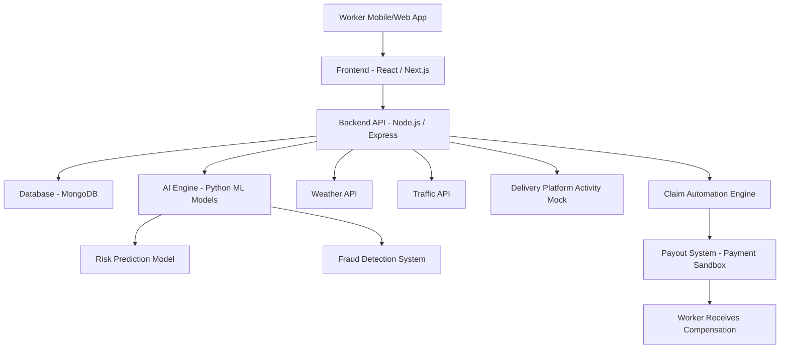

# GigShield AI 🛡️

## 🎥 Phase 1 Strategy Video

**[Watch our Strategy & Idea Pitch on Google Drive](https://drive.google.com/file/d/1wZEXMwtiGwuAiHDdw3YlAThXuXKnm6_3/view?usp=sharing)**

---

## AI-Powered Parametric Income Protection for Gig Delivery Workers

GigShield AI is an AI-powered parametric insurance platform designed to protect gig delivery workers from income loss caused by external disruptions such as heavy rain, pollution, floods, and curfews.

Gig workers depend on daily earnings to sustain their livelihood. When external disruptions occur, deliveries stop and workers instantly lose 20-30% of their income. GigShield AI detects these disruptions using AI and external data sources and compensates workers through automated parametric insurance payouts.

Our mission is to build a financial safety net for the gig workforce.

---

# 📌 Project Overview

| Feature            | Description                                        |
| :----------------- | :------------------------------------------------- |
| **Target Users**   | Food delivery workers (Swiggy / Zomato)            |
| **Problem**        | Income loss due to weather, pollution, and curfews |
| **Solution**       | AI-powered parametric insurance                    |
| **Pricing Model**  | Weekly insurance plans                             |
| **AI Components**  | Risk prediction + fraud detection                  |
| **Unique Feature** | Income Stability Score                             |
| **Architecture**   | MERN stack + Python AI engine                      |

---

# 🛡️ MARKET CRASH: Adversarial Defense & Anti-Spoofing Strategy

_In response to the Phase 1 Market Crash identifying coordinated fraud rings and GPS spoofing._

To safeguard platform liquidity against sophisticated bad actors, GigShield AI implements a **Multi-Layered Validation Engine**:

- **Spatial-Temporal Fleet Coherence**: The AI cross-references an individual's GPS ping against the "Fleet Velocity" of 50+ other riders in the same 500-meter grid. If 95% of the fleet is moving while a claimant reports "halted deliveries," the claim is auto-flagged.
- **Hyper-Local Environmental Verification**: We utilize grid-based weather validation. A "fake rainstorm" claim is instantly invalidated if our secondary high-resolution precipitation APIs (ClimaCell/OpenWeather) show rainfall below the 70mm threshold for that specific coordinate.
- **Hardware Sensor Fusion**: The system monitors device Accelerometer and Gyroscope data. While software can spoof coordinates, it rarely mimics the natural mechanical "jitter" and vibration of a moving vehicle, allowing the AI to distinguish between a real rider and a static fraud ring.
- **Behavioral Trust Scoring**: New accounts or devices with "Developer Options" enabled are subjected to a 24-hour verification delay, while veteran riders with high **Income Stability Scores** receive "Fast-Track" automated approval.

---

# 👤 Target Persona – Food Delivery Riders

We selected food delivery partners such as **Swiggy and Zomato** as our primary persona.

### Worker Profile

- **Daily Earnings**: ₹800 – ₹1200
- **Deliveries per day**: 18–25
- **Working hours**: 8–10 hours

### Key Risks

- Heavy rain and flooding
- Severe air pollution
- Traffic shutdowns and curfews

---

# 💰 Weekly Insurance Pricing Model

Gig workers operate on weekly earning cycles, so GigShield AI uses a weekly insurance model.

| Plan         | Weekly Premium | Income Protection |
| :----------- | :------------- | :---------------- |
| **Basic**    | ₹15/week       | ₹400 payout       |
| **Standard** | ₹25/week       | ₹700 payout       |
| **Premium**  | ₹40/week       | ₹1200 payout      |

**⚠ Coverage applies strictly to income loss only.**
The platform does **not** cover vehicle repairs, medical claims, or accident insurance.

---

# ⭐ Income Stability Score (Predictive AI)

GigShield AI introduces an **Income Stability Score**, an AI-generated metric (0–100) predicting income disruption risk.

**How the Score is Calculated:**

- Weather Risk (30%) + Traffic Risk (20%) + Demand Stability (30%) + Historical Disruptions (20%).

**Why This Feature Matters:**
Traditional systems react after disruptions occur. GigShield AI predicts risk **before disruptions happen**, allowing workers to proactively protect their income.

---

# 🏗 System Architecture

- **Frontend**: React / Next.js
- **Backend**: Node.js / Express
- **AI Engine**: Python (Scikit-learn)
- **Database**: MongoDB
- **External APIs**: Weather API, Traffic API, Platform Activity Mock, and Payment Sandbox.

